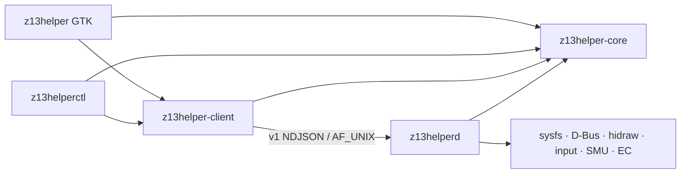

# Architecture

## Boundaries

The Cargo workspace has five crates:

| Crate | Boundary |
|---|---|
| `z13helper-core` | Pure profiles, v1 protocol, errors, config, curve math, safety policy, apply planning |
| `z13helper-client` | Versioned NDJSON Unix-socket transport |
| `z13helper` | GTK application, controllers, section views, and background UI services |
| `z13helperd` | Privileged hardware ownership, persistence, lifecycle, and event dispatch |
| `z13helperctl` | Stateless diagnostic and scripting client |

Core and client remain separate intentionally. Core contains no sockets, GTK,
D-Bus, sysfs, or hardware I/O and is shared by all binaries. Client contains
only transport and timeout/error mapping and is shared by the GUI and CLI.

Only `z13helperd` touches hardware. The socket is
`/run/z13helper/z13helperd.sock`, owned by `root:z13helper`. Requests carry a
protocol version, stable wire error codes, a bounded line size, and a command
deadline. Complete applies are serialized so the last successful request wins.

## State ownership

User-facing profile names and UI preferences live in the fresh schema-version-1
file `$XDG_CONFIG_HOME/z13helper/config.json`. There are no schema migrations.
Unknown schema versions are preserved and rejected.

The daemon atomically persists only flattened desired machine state at
`/var/lib/z13helper/state.json`. On first boot without that file, it observes
the PPD-selected policy and leaves direct EC mode released. Startup and resume
restore fan protection before high power, followed by undervolt, the persistent
battery policy, and lighting. The stored battery
limit remains the normal slider value; a separate one-time flag temporarily
writes 100% and is cleared only after the normal limit is restored at full
charge.

## Apply transaction

The daemon prevalidates the entire request before the first hardware mutation.
For an ordinary or lower-power apply:

1. Select PPD. Missing PPD produces a visible warning; an unknown
   advertised selection is rejected.
2. Lower/write optional PPT before relaxing prior high-power fan protection.
3. Install firmware or direct fan control.
4. Restore the requested 80–99°C APU thermal limit through paired Strix Halo
   Tctl/cHTC SMU commands and verify the effective PM-table value.
5. Restore the requested undervolt offset last.

When raising PL1 to 80 W or above, step 3 moves before the power write. A fan-setup
failure abandons the power increase. If a later step fails, the daemon attempts
rollback without dropping safety fan protection; incomplete rollback sets
`degraded` and records warnings in `DaemonState`.

## Fan policy

Profiles carry two authored eight-point curves, directional hysteresis, and
select firmware or direct mode.

- At 80 W and above, unless the confirmed Advanced override is enabled, a temporary
  hardware copy locks point 7 to 80°C and at least 80% PWM and point 8 to 90°C
  and 100%. Firmware mode verifies both ASUS `pwm_enable` interfaces.
- Direct mode samples native-resolution temperature on a 250 ms control path and
  shares the latest sample with the slower telemetry path. It averages recent
  samples before interpolating the effective curve into raw 0–255 PWM duty. The
  per-profile averaging window defaults to 6 seconds and can be set from 0–15
  seconds; 0 disables averaging. Its per-profile 1–5 speed-up and slow-down
  hysteresis applies only to direction reversals and defaults to 3/3. A fresh
  direct-mode install establishes the curve target immediately; subsequent duty
  changes ramp up within one second and down over roughly 2.5 seconds. RPM is
  separate one-second telemetry, and unchanged PWM duties are not rewritten.
- Below 80 W endpoint protection is inactive.
- No temperature-only 96°C full-speed override exists. CPU and firmware thermal
  throttling remain the final authority.

EC automatic-mode release is the first startup action and occurs before suspend,
on sensor failure, repeated EC errors, failed restore, normal shutdown, and the
restricted systemd `ExecStopPost` recovery path.

## Hardware adapters

The daemon owns adapters for:

- effective five-value PPT state;
- power-profiles-daemon profiles/current selection over D-Bus;
- both firmware fan interfaces and direct EC mailbox control;
- serialized factory fan-curve retrieval through ASUS WMI mode 3, with PPD and
  the previous desired machine state restored after each query;
- a single startup `ryzen_smu` MP1 `0x4C` availability probe and cached result;
- persistent keyboard/lightbar hidraw handles with hotplug relight;
- battery thresholds 40–100, a persistent one-time 100% override that restores
  the normal threshold at full charge, full-versus-design battery health
  telemetry, and panel overdrive;
- non-exclusive `KEY_PROG3` monitoring with reconnect and `gui-toggle` events;
- temperature and two calibrated fan RPM readings.

The user config owns the panel-overdrive policy (`always on` or `plugged in
only`). The GTK power-source watcher resolves that policy after each confirmed
transition and asks the daemon to persist and write the flattened effective
hardware value. This policy is independent of profile auto-switching.

Tests use injectable fake roots for sysfs/hwmon/SMU/hidraw/input behavior.

## GTK threading and views

The GTK crate separates application orchestration, background services, and UI
sections. Named views expose reconciliation behavior and share one depth-based
`SyncGuard`, so daemon refreshes cannot trigger write callbacks. Socket and
D-Bus calls run through `worker::blocking`; GTK widgets are touched only after
the result returns to the GLib main context.

The 368-pixel-wide, non-resizable main window derives its height from the
compact controls, keeping Silent, Balanced, Turbo, and Fans + Power fully
visible without empty space below the footer. Custom profiles stay in Fans +
Power instead of adding rows to the main window. Fans + Power uses a full-width
profile toolbar, dual balanced charts, adaptive wide/stacked content,
full-width equal-allocation scales, and one persistent bottom action bar. Main
content remains vertically scrollable when the
compositor must fit the window to a shorter display. Profile choices expose
grouped toggle semantics, persistent states use banners, and operation results
use toasts. Fan charts inherit theme colors and font scaling and expose their
selected points to assistive technology. Outer/section/row/compact spacing is
12/12/8/6 px.

GTK rules retained from field testing: never use CSS `hexpand`,
`Scale::add_mark`, or animated box shadows, and keep custom chart drawing
theme-aware. X11 is forced only when `GAMESCOPE_WAYLAND_DISPLAY` resolves to a
real socket inside `XDG_RUNTIME_DIR` and an X11 display is advertised. In that
mode interactive toplevels use gamescope's `STEAM_OVERLAY` and
`STEAM_INPUT_FOCUS` properties, while click-through HUDs use
`GAMESCOPE_EXTERNAL_OVERLAY`. Exactly one interactive toplevel has nonzero
opacity and input focus; hidden windows remain mapped to avoid Xwayland surface
lifecycle loss, and input focus is cleared before opacity. Resolution-derived
CSS and panel sizing default to about 1.5x on the native Z13 panel and accept a
clamped `Z13HELPER_GAMESCOPE_SCALE` override. The main drawer is clamped to 320
logical pixels. Because Gamescope does not reliably composite GTK popup
surfaces, its selectors use in-surface button groups or embedded dialogs and
its color chooser is a page in the main window stack.

Controller capture follows the hardware-access boundary: only `z13helperd`
opens controller evdev nodes and issues `EVIOCGRAB`; the GUI receives normalized
protocol-v2 D-pad/A/B actions and touches widgets only on GLib's main context.
The GUI renews a three-second capture lease once per second while the Gamescope
overlay is visible. Hiding or closing waits 200 ms to consume the dismiss
release before relinquishing capture, and lease expiry provides crash recovery.
Touchscreen and touchpad nodes without gamepad buttons are excluded; Steam's
known virtual gamepad is capture-only. Direction holds repeat after 400 ms at
120 ms intervals. The reader blocks in `poll(2)` on controller fds and a private
capture-control socket, waking for real input, lease transitions, repeat
deadlines, or the two-second hotplug scan. Once a Gamescope capture lease is active, the daemon attaches a small BPF LSM
program using `CAP_BPF` and `CAP_PERFMON`. During capture it blocks only the
daemon-derived Steam process tree from reading hidraw device nodes, which
prevents duplicate PlayStation/Nintendo input without pausing Steam or granting
capabilities to the GUI. The hidraw major is read from `/proc/devices`, and the
BPF program uses the kernel `i_rdev` major encoding (`dev >> 20`). The BPF map is
cleared before the controller is released and when the daemon shuts down. The
system unit therefore keeps `/proc` visible enough to discover Steam and leaves
`MemoryDenyWriteExecute` off so libbpf can load the LSM program.

GTK accessibility remains enabled for screen readers and other assistive
technology. Ctrl+W closes the active auxiliary window or hides the main window.
Ctrl+Q closes auxiliary windows and hides the main window without terminating
the resident UI process, allowing the hardware button to present it again. The
main title-bar close button follows the same hide behavior. Auxiliary windows
are registered with the GTK application and the gamescope window stack so these
accelerators and active-window routing apply consistently. Window headers expose
close controls without minimize controls. Icon-only and profile action buttons
expose explicit accessible names and tooltips.

On KDE, the process consumes the legacy GTK dark-theme preference before
libadwaita initializes and transfers it to `AdwStyleManager::PreferDark`. This
preserves Plasma's dark appearance without using libadwaita's unsupported
`gtk-application-prefer-dark-theme` path or modifying the user's GTK settings.

## Lifecycle and packaging

The user service optionally loads `%t/gamescope-environment`; gamescope-session
uses that file to export its display variables to background user services. The
GUI validates the advertised gamescope socket before selecting X11, so a stale
environment file cannot by itself enable the overlay backend.

The systemd unit uses `RuntimeDirectory=z13helper`,
`StateDirectory=z13helper`, AF_UNIX-only networking, `ProtectSystem=strict`,
explicit writable hardware paths, `CAP_SYS_RAWIO`, and the narrowly scoped
`CAP_BPF`/`CAP_PERFMON` pair required to attach the hidraw blocker. The
installed application ID is `com.ashtonantila.z13helper`.

No compatibility aliases, predecessor-path discovery, or automatic removal
actions are shipped.
