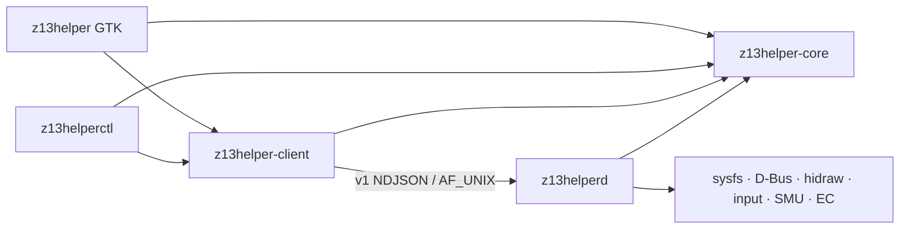

# Architecture

## Boundaries

The Cargo workspace has five crates:

| Crate | Boundary |
|---|---|
| `z13helper-core` | Pure profiles, v1 protocol, errors, config, curve math, safety policy, apply planning |
| `z13helper-client` | Versioned NDJSON Unix-socket transport |
| `z13helper` | GTK application, controllers, section views, and background UI services |
| `z13helperd` | Privileged hardware ownership, persistence, lifecycle, and event dispatch |
| `z13helperctl` | Stateless diagnostic and scripting client |

Core and client remain separate intentionally. Core contains no sockets, GTK,
D-Bus, sysfs, or hardware I/O and is shared by all binaries. Client contains
only transport and timeout/error mapping and is shared by the GUI and CLI.

Only `z13helperd` touches hardware. The socket is
`/run/z13helper/z13helperd.sock`, owned by `root:z13helper`. Requests carry a
protocol version, stable wire error codes, a bounded line size, and a command
deadline. Complete applies are serialized so the last successful request wins.

## State ownership

User-facing profile names and UI preferences live in the fresh schema-version-1
file `$XDG_CONFIG_HOME/z13helper/config.json`. There are no schema migrations.
Unknown schema versions are preserved and rejected.

The daemon atomically persists only flattened desired machine state at
`/var/lib/z13helper/state.json`. On first boot without that file, it retains the
detected base, restores the measured stock PPT table, and leaves direct EC mode
released. Startup and resume restore fan protection before high power, followed
by undervolt, the persistent battery policy, and lighting. The stored battery
limit remains the normal slider value; a separate one-time flag temporarily
writes 100% and is cleared only after the normal limit is restored at full
charge.

## Apply transaction

The daemon prevalidates the entire request before the first hardware mutation.
For an ordinary or lower-power apply:

1. Select the base on every platform-profile device and restore its measured
   five-value stock PPT table while retaining existing fan protection.
2. Select PPD independently. Missing PPD produces a visible warning; an unknown
   advertised selection is rejected.
3. Lower/write PPT before relaxing prior high-power fan protection.
4. Install firmware or direct fan control.
5. Restore the requested undervolt offset.

When raising PL1 above 75 W, step 4 moves before the power write. A fan-setup
failure abandons the power increase. If a later step fails, the daemon attempts
rollback without dropping safety fan protection; incomplete rollback sets
`degraded` and records warnings in `DaemonState`.

## Fan policy

Profiles carry two authored eight-point curves and select firmware or direct
mode. Authored values are immutable inputs to the runtime safety layer.

- Firmware mode applies the configured high-power floor to a temporary hardware
  copy and verifies both ASUS `pwm_enable` interfaces. It reports
  `firmware_armed`; release hysteresis and dwell do not apply.
- Direct mode interpolates each authored curve in the EC loop. `FloorGate`
  engages at the configured temperature, releases only below the release point
  after dwell, and reports `direct_engaged` or `direct_released`.
- At or below 75 W the state is `inactive`.
- No temperature-only 96°C full-speed override exists. CPU and firmware thermal
  throttling remain the final authority.

EC automatic-mode release is the first startup action and occurs before suspend,
on sensor failure, repeated EC errors, failed restore, normal shutdown, and the
restricted systemd `ExecStopPost` recovery path.

## Hardware adapters

The daemon owns adapters for:

- all platform-profile devices, including quiet/low-power mapping;
- effective five-value PPT state;
- power-profiles-daemon profiles/current selection over D-Bus;
- both firmware fan interfaces and direct EC mailbox control;
- a single startup `ryzen_smu` MP1 `0x4C` availability probe and cached result;
- persistent keyboard/lightbar hidraw handles with hotplug relight;
- battery thresholds 40–100, a persistent one-time 100% override that restores
  the normal threshold at full charge, full-versus-design battery health
  telemetry, and panel overdrive;
- non-exclusive `KEY_PROG3` monitoring with reconnect and `gui-toggle` events;
- temperature and two calibrated fan RPM readings.

The user config owns the panel-overdrive policy (`always on` or `plugged in
only`). The GTK power-source watcher resolves that policy after each confirmed
transition and asks the daemon to persist and write the flattened effective
hardware value. This policy is independent of profile auto-switching.

Tests use injectable fake roots for sysfs/hwmon/SMU/hidraw/input behavior.

## GTK threading and views

The GTK crate separates application orchestration, background services, and UI
sections. Named views expose reconciliation behavior and share one depth-based
`SyncGuard`, so daemon refreshes cannot trigger write callbacks. Socket and
D-Bus calls run through `worker::blocking`; GTK widgets are touched only after
the result returns to the GLib main context.

The 368-pixel-wide, non-resizable main window derives its height from the
compact controls, keeping Silent, Balanced, Turbo, and Fans + Power fully
visible without empty space below the footer. Custom profiles stay in Fans +
Power instead of adding rows to the main window. Fans + Power uses a full-width
profile toolbar, dual balanced charts, adaptive wide/stacked content,
full-width equal-allocation scales, and one persistent bottom action bar. Main
content remains vertically scrollable when the
compositor must fit the window to a shorter display. Profile choices expose
grouped toggle semantics, persistent states use banners, and operation results
use toasts. Fan charts inherit theme colors and font scaling and expose their
selected points to assistive technology. Outer/section/row/compact spacing is
12/12/8/6 px.

GTK rules retained from field testing: never use CSS `hexpand`,
`Scale::add_mark`, or animated box shadows; force X11 only for a real gamescope
Wayland socket; use `GAMESCOPE_EXTERNAL_OVERLAY`; and keep custom chart drawing
theme-aware. GTK accessibility remains enabled for screen readers and other
assistive technology. Ctrl+W closes the active auxiliary window or hides the
main window. Ctrl+Q closes auxiliary windows and hides the main window without
terminating the resident UI process, allowing the hardware button to present
it again. The main title-bar close button follows the same hide behavior.
Auxiliary windows are registered with the GTK application so these accelerators
and active-window routing apply consistently. Window headers expose close
controls without minimize controls. Icon-only and profile action buttons expose
explicit accessible names and tooltips.

On KDE, the process consumes the legacy GTK dark-theme preference before
libadwaita initializes and transfers it to `AdwStyleManager::PreferDark`. This
preserves Plasma's dark appearance without using libadwaita's unsupported
`gtk-application-prefer-dark-theme` path or modifying the user's GTK settings.

## Lifecycle and packaging

The systemd unit uses `RuntimeDirectory=z13helper`,
`StateDirectory=z13helper`, AF_UNIX-only networking, `ProtectSystem=strict`,
explicit writable hardware paths, and only `CAP_SYS_RAWIO`. The installed
application ID is `com.ashtonantila.z13helper`.

No compatibility aliases, predecessor-path discovery, or automatic removal
actions are shipped.
