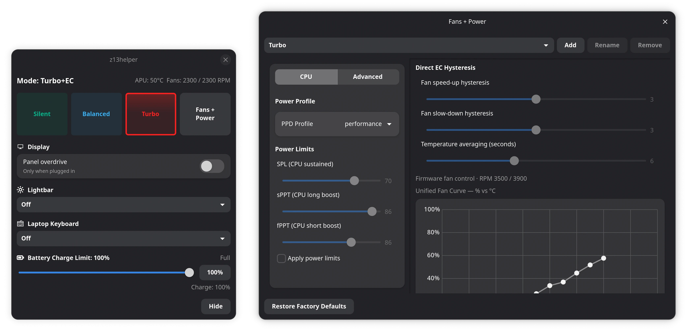

# z13helper

**G-Helper alternative for the ASUS ROG Flow Z13 (2025 / GZ302) on Linux.**



## AI usage disclaimer

Parts of this project were written with assistance from AI coding tools. The
behavior that matters — power limits, fan curves, undervolt, and restore after
sleep — is still meant to be reviewed, tested, and owned by humans. Treat
hardware controls as safety-critical: verify changes on your device, keep
sensible limits, and do not assume generated code is correct by default.

## About / Features

`z13helper` is a lightweight, Rust-based Armoury Crate/G-Helper alternative for the 2025 ROG Flow Z13 running Linux.

Some of the features include:

- **Profiles** — Silent, Balanced, and Turbo built-ins, plus custom profiles
- **Power** — power-profiles-daemon sync and five-value PPT / TDP limits
- **Fans** — firmware-based or direct EC curves (similar to the experimental fan control in G-Helper)
- **Thermals** — per-profile APU temperature limit (up to 99°C)and optional undervolt
- **Battery** — charge limit (40–100%) and one-time full-charge override
- **Display** — panel overdrive policy (always on, or plugged-in only)
- **Lighting** — keyboard and lightbar
- **Gamescope** — resident overlay with gamepad navigation in Gaming Mode

## Getting Started / Installation

### Requirements

- ASUS ROG Flow Z13 **GZ302EA** (2025)
- Linux with systemd
- Rust **1.92+** (edition 2024)
- GTK **4.14+**, libadwaita **1.5+**, and `gtk4-layer-shell`
- Optional: `power-profiles-daemon`, `ryzen_smu` (for undervolt)

### Build and install

```sh
make build
make test
make lint
make install
make install-user-service
sudo make install-service
sudo usermod -aG z13helper "$USER"
```

Then log out and back in so group membership takes effect.

| Step | What it does |
|---|---|
| `make install` | Installs `z13helper`, `z13helperctl`, desktop entry, and icon under `~/.local` by default |
| `make install-user-service` | Starts the GUI as a user service (hidden until opened by the hardware button or launcher) |
| `sudo make install-service` | Installs and enables the privileged `z13helperd` system service |

After install, launch **z13helper** from your app menu, or run `z13helper`.
For scripting, try `z13helperctl status` and `z13helperctl probe`.

### Nix

A flake provides packages, a dev shell, a NixOS module, and a Home Manager
module:

```sh
nix develop
nix build                 # release package
nix build .#z13helper-debug
nix flake check
```

NixOS example:

```nix
{
  inputs.z13helper.url = "github:UHDbits/z13helper";

  outputs = { nixpkgs, z13helper, ... }: {
    nixosConfigurations.z13 = nixpkgs.lib.nixosSystem {
      modules = [
        z13helper.nixosModules.default
        {
          services.z13helperd.enable = true;
          services.z13helperd.users = [ "alice" ];
          programs.z13helper.enable = true;
        }
      ];
    };
  };
}
```

Home Manager can also own `$XDG_CONFIG_HOME/z13helper/config.json` via
`programs.z13helper.settings` (see `ARCHITECTURE.md` and `nix/home-manager.nix`).

## Additional Details

### Components

| Component | Role |
|---|---|
| `z13helper` | Desktop UI and named user profiles |
| `z13helperd` | Root hardware daemon and sole hardware writer |
| `z13helperctl` | JSON-friendly diagnostics and scripting CLI |

Shared libraries (`z13helper-core`, `z13helper-client`) ship inside those
binaries; they are not separate services.

### Paths

| Path | Purpose |
|---|---|
| `$XDG_CONFIG_HOME/z13helper/config.json` | User profiles and UI preferences (schema v1) |
| `/run/z13helper/z13helperd.sock` | Daemon socket (`root:z13helper`) |
| `/var/lib/z13helper/state.json` | Flattened machine state restored across reboot/resume |

Unsupported config schema versions are left untouched. Corrupt files are
preserved as `config.json.corrupt` and replaced with defaults. The installer
only manages current `z13helper` identifiers — no predecessor-path discovery
or unrelated cleanup.

### Safety highlights

- Applies are validated end-to-end and serialized; the last successful request
  wins.
- Raising PL1 to **80 W or above** requires fan protection first; if that
  preparation fails, the power increase is abandoned.
- At 80 W+, hardware fan endpoints are locked unless you confirm the Advanced
  override.
- Undervolt is applied last. On failure, safety fan protection is retained and
  incomplete rollback is reported as degraded state.
- There is no temperature-only “panic to 100%” fan override; CPU/firmware
  throttling stays authoritative.

### Gamescope

When a real gamescope Wayland socket is present and X11 is available, the app
uses gamescope’s overlay path. The resident UI can stay mapped while hidden,
open Fans + Power as a separate overlay surface, and accept D-pad / stick / A /
B navigation while a short capture lease is active. PlayStation and Nintendo
controllers can also get narrow hidraw suppression for Steam’s process tree
when BPF LSM support is available.

### CLI quick reference

```text
z13helperctl status
z13helperctl probe
z13helperctl watch [event]
z13helperctl apply <json-file|->
z13helperctl ppd <profile|off>
z13helperctl tdp <pl1> <pl2> <fppt> [apu-sppt platform-sppt]
z13helperctl undervolt <-40..0|off>
z13helperctl fans <firmware|direct|off> [curves-json-file]
z13helperctl lighting <keyboard|lightbar> <off|mode> [color] [brightness]
z13helperctl battery-limit <40..100>
z13helperctl battery-charge-once <on|off>
z13helperctl panel-overdrive <on|off>
z13helperctl release-fans
```

### Development

```sh
make build
make run
make test
make lint
make fmt
```

Deeper design notes — apply order, fan policy, threading, and packaging —
live in [`ARCHITECTURE.md`](ARCHITECTURE.md). Agent/contributor constraints are
in [`AGENTS.md`](AGENTS.md).

### License

MIT. ASUS and ROG are trademarks of their respective owners.
